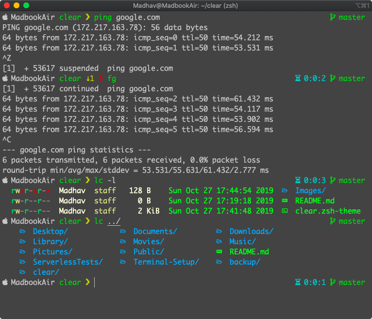

<p align="center">
    
<p align="center">A simple, fast and minimal prompt.</p>

</br>
<p align="center"></p>

#### Left Prompt
* OS logo
* Computer Name
* Current Directory (depth==1)
* Background Jobs
* Prompt (based on exit status of last cmd)

#### Right Prompt
* Time for execution (of last cmd if greater than one second)
* Branch (git with colors for various stages)

## Installation

### [Antigen](https://github.com/zsh-users/antigen)

Update your `.zshrc` file with:

```sh
antigen bundle madhavchoudhary/clear
```

### [Antibody](https://github.com/getantibody/antibody)

Update your `.zshrc` file with:

```sh
antibody bundle madhavchoudhary/clear
```

### [Oh My Zsh](http://ohmyz.sh)

```sh
wget -O $ZSH_CUSTOM/themes/common.zsh-theme https://raw.githubusercontent.com/madhavchoudhary/clear/master/clear.zsh-theme
```

Update your `.zshrc` file with:
```sh
ZSH_THEME="clear"
```

## Complete Setup

Please follow [this](https://github.com/MadhavChoudhary/Terminal-Setup) documentation to install and setup the terminal completely from scratch for development in macOS as shown in the sample image.  
